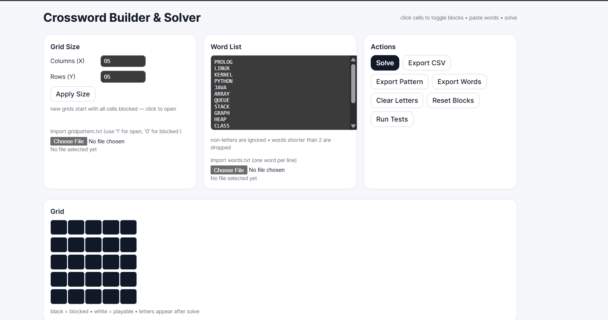
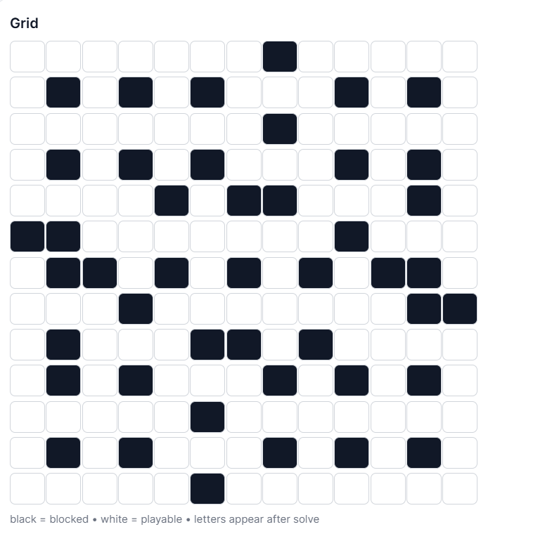
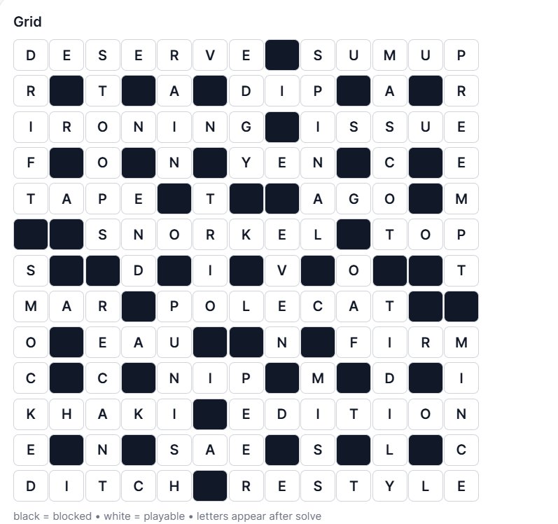

# 🧩 Crossword Builder & Solver  

A **React + TypeScript** web app that lets you design and solve your own crossword puzzles — powered by **Tau-Prolog** in the browser (with a pure JS fallback).  

Build, import, export, and auto-solve crosswords — right from your browser.

---

## 🌐 Live Demo  
🚀 **Try it here:**  
- **GitHub Pages:** https://<your-username>.github.io/crossword-app  
- **Vercel (recommended):** https://crossword-app.vercel.app  

---

## ✨ Features  

| 🧠 Smart Logic | 🧩 Grid Tools | 📤 Import & Export | 🧪 Testing |
|----------------|---------------|--------------------|-------------|
| Uses Tau-Prolog (logic programming) for solving | Click to toggle cells between open/blocked | Import or export `bin.txt` grid patterns | Built-in test cases for debugging |
| Fallback to fast JS MRV (backtracking) solver | Auto-detects horizontal & vertical word slots | Export your grid as CSV or word list | Run consistency checks instantly |

---

## 🧱 Tech Stack  

- ⚛️ **React + TypeScript** (Vite)
- 🧮 **Tau-Prolog** UMD module  
- 🎨 **Tailwind / Inline Styling**  
- 💾 **Local file I/O** for `.txt` & `.csv`
- 🧰 **Node + NPM** for build & dev

---

## 🧩 How to Run Locally  

```bash
# clone the repo
git clone https://github.com/<your-username>/crossword-app.git
cd crossword-app

# install dependencies
npm install

# start dev server
npm run dev
```

Then open 👉 **http://localhost:5173**

---

## ⚙️ Build for Production  

```bash
npm run build
npm run preview
```

This generates an optimized version of your app in the `dist/` folder.  
You can deploy it to **GitHub Pages**, **Vercel**, or **Netlify**.

---

## 📁 Project Structure  

```
crossword-app/
 ├── public/              # static assets
 ├── src/                 # source code
 │    ├── App.tsx         # main React component
 │    ├── logic/          # Prolog + JS solver logic
 │    └── styles/         # custom styles
 ├── package.json
 ├── vite.config.ts
 └── README.md
```

---

## 📸 Screenshots  

| Full Webpage View | Unsolved Grid | Solved Grid |
|:--------------:|:------------:|:-----------------:|
|  |  |  |

> 🖼️ *All screenshots are stored inside the `/screenshots` folder for easy viewing.*

---

## 💡 Key Concepts  

- **Constraint satisfaction:** words must match at crossing letters.  
- **Logic programming:** Prolog enforces constraints declaratively.  
- **Fallback solving:** a JS MRV (Minimum Remaining Values) solver ensures it works even offline.  

---

## 🧰 Scripts  

| Command | Description |
|----------|-------------|
| `npm run dev` | Run development server |
| `npm run build` | Build for production |
| `npm run preview` | Preview production build |

---

## 👨‍💻 Author  

**Hassan Sajid**  
📍 Windsor, ON, Canada  
🎓 Built as part of my learning in **React, Logic Programming, and Frontend Development**  


---

## 🪄 License  
MIT License © 2025 Hassan Sajid 

---

⭐ **If you like this project, consider giving it a star!**  
